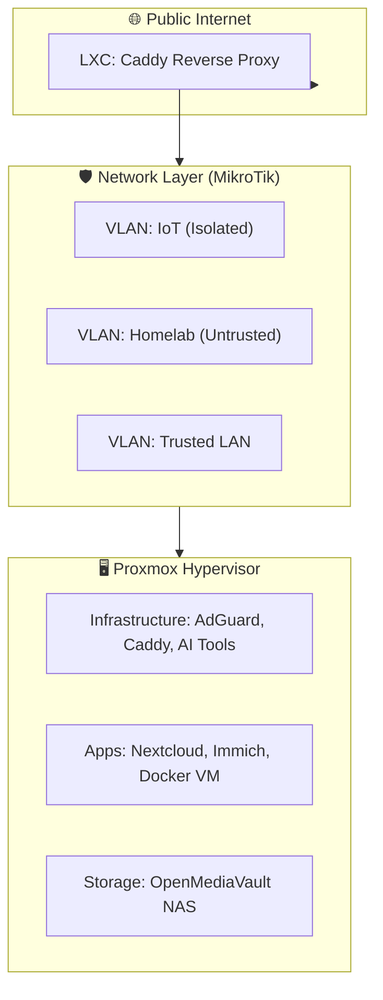

# 🚀 Homelab Blueprint: Infrastructure & Service Documentation

This repository is the central "Source of Truth" for my private cloud infrastructure. It transitions my homelab from a monolithic "manual" setup to a mature, distributed, GitOps-driven architecture.

---

## 🏗️ The Architecture
My lab is built on a **Defense-in-Depth** philosophy, utilizing a dual-router physical isolation strategy and a Proxmox hypervisor layer.



---

## 🤖 Infrastructure as Intent
Instead of relying on rigid, syntax-heavy Infrastructure as Code (IaC) tools like Ansible, this homelab utilizes **Infrastructure as Intent** and **Agentic Automation**.

By maintaining a highly structured set of Markdown notes, an AI Agent acts as the automation layer. The notes serve a dual purpose: human-readable documentation and machine-executable playbooks.
*   **Zero Syntax Overhead:** Avoids the rigid syntax of traditional IaC tools. Logic is plain English and standard shell commands.
*   **Context-Aware Execution:** The agent can diagnose, pivot, and handle unexpected errors on the fly during deployment, ensuring documentation acts as the exact executable "source of truth".

### The "Nuke and Pave" Recovery Workflow
If a node fails catastrophically:
1. **Spin up a fresh instance:** Create a new VM/LXC with the same IP.
2. **Invoke the Agent:** Provide the relevant setup markdown note to rebuild the service from scratch.
3. **Agent Execution:** The agent connects via SSH, installs packages, writes configurations, and runs verification checks automatically based on the note.

---

## 💾 Storage & NAS Directory Layout
The following structure organizes data across the primary storage pool (typically mounted under `/mnt/pool` using a combination of LVM, ZFS, or MergerFS).

```text
# App-specific metadata (configs, databases, local cache).
└── Apps/
    └── photoprism/
    └── anytype/

# Sensitive and private documents (served via SMB & VPN only).
└── Private/
    ├── Documents/
    ├── Photos/
    ├── Video/
    └── Audio/

# Public/Shared media for Jellyfin & Symfonium.
└── Media/
    ├── Music/
    └── Videos/

# Ingest zone for new content.
└── Downloads/
    ├── Torrents/
    └── Youtube/

# Collaboration and public-facing shares.
└── Shared/
    ├── Users/
    │   ├── [USER-A]/
    │   ├── [USER-B]/
    │   └── Public/
    │   └── Recycled
    └── Content/
        ├── Public gallery/
        └── Temporary share/

# Encrypted shares for sensitive remote access (e.g., Nextcloud).
└── Shared_enc/
    ├── Photos_[USER-A]/
    └── Documents_[USER-B]/
```

**Usage Principles:**
1. **Separation of Concerns:** Apps store their persistent configuration in `/Apps`, keeping `/Media` and `/Private` clean for data only.
2. **Access Control:** `/Private` should never be exposed to public-facing services without additional encryption layers.

---

## 🛡️ The Tiered Backup Strategy
Moving away from a monolithic backup approach, we implement a pyramid where the tool matches the required recovery speed and granularity.

| Tier | Purpose | Recommended Tool | Frequency | Target |
| :--- | :--- | :--- | :--- | :--- |
| **1. Infrastructure (Code)** | Scripts, `docker-compose.yml`, configs. | **Git** (Gitea/GitHub) | On Change | Local/Cloud Repo |
| **2. Disaster Recovery** | Entire VMs and LXC state. | **Proxmox Backup Server (PBS)** | Daily | Dedicated Backup Disk |
| **3. App Data (State)** | Databases, specific volume bind-mounts. | **Kopia** | Hourly/Daily | NAS / Offsite (S3) |
| **4. Bulk Storage** | Huge media files, ISOs. | **BTRFS Snapshots** | Daily | Local OMV Storage |

*Note: Stop backing up raw Docker volumes (`/var/lib/docker/volumes`). Rely on PBS for complete VM recovery or Kopia for specific bind-mounted datasets (`/srv/services/app/config`).*

---

## ⚙️ Deployment & Workflow

### The "Dev/Prod Split" Workflow
To avoid "commit spam" when testing Docker configurations:
1.  **Develop:** Edit `docker-compose.yml` locally via VS Code.
2.  **Test:** Run `docker compose up -d` in the terminal to verify the change works.
3.  **Commit:** Push the successful config to GitHub.
4.  **Deploy:** Portainer (on Polling/Webhook) pulls the official config and manages the container.

### Secrets Management (The "2026 Pro" Standard)
- **`.env` Files:** Hardcoded paths/IPs are avoided. Dynamic variables are loaded from `.env` files. Ensure `*.env` and `.secrets/` are globally `.gitignore`d.
- **Centralized Secrets Vault:** Currently, a cron script (`scrape_secrets.sh`) SSHes into nodes to back up `*.env` files to a secure, non-Git vault. 
- **Future Migration (SOPS):** Eventual goal is to encrypt `.env` values at rest using SOPS and commit them directly into Git, decrypting on the target server via Age keys.

### Script Migration Standards
- **Symlinking:** Scripts in the repo are symlinked to their intended system paths (e.g., `/usr/local/bin`). A simple `git pull` instantly updates active scripts.
- **Docstrings & Changelogs:** Keep a concise block at the top explaining purpose and requirements. Rely on Git history, not manual changelogs.
- **Execution:** Before executing any git operations, the agent must present a clear plan and gain explicit approval. Batched pushes are preferred.

---

## 📂 Repository & Obsidian Vault Index
The repository is organized following standard DevOps chapters. This structure also mirrors the centralized Obsidian Vault structure.

- **[00_Infrastructure](./docs/00_Infrastructure/)**: Bare-metal specs, Inventory, and Hypervisor/OS setup guides.
- **[01_Network](./docs/01_Network/)**: Routing logic, VLAN segmentation, and VPN configs.
- **[02_Services](./docs/02_Services/)**: Modular runbooks for self-hosted applications.
- **[03_Maintenance](./docs/03_Maintenance/)**: Tiered backup strategy and exclusion rules.
- **[04_Resources](./docs/04_Resources/)**: Linux CLI cheat sheets and external documentation links.
- **[05_AI_Tools](./docs/05_AI_Tools/)**: Agentic AI setup and IDE integrations.
- **[99_Archive](./docs/99_Archive/)**: Historical research and deprecated setups.

---

## 🛠️ Tech Stack
*   **Hypervisor:** Proxmox VE
*   **Storage:** OpenMediaVault (SMB/NFS)
*   **Networking:** MikroTik RouterOS (VLANs)
*   **Ingress:** Caddy (Automated TLS)
*   **AI:** Gemini CLI, OpenClaw

---
*Created and maintained with the help of Gemini CLI Agent.*
