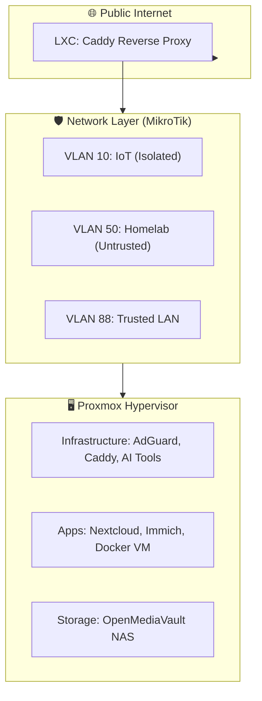

# 🚀 Susnode Homelab: Infrastructure & Service Blueprint

This repository is the central "Source of Truth" for my private cloud infrastructure. It transitions my homelab from a monolithic "manual" setup to a mature, distributed, and documented architecture.

---

## 🏗️ The Architecture
My lab is built on a **Defense-in-Depth** philosophy, utilizing a dual-router physical isolation strategy and a Proxmox hypervisor layer.

---

## 📂 Repository Index
The repository is organized following the dependency chain of a professional environment:

- **[00_Infrastructure](./docs/00_Infrastructure/)**: Bare-metal specs, PVE Map, and Hypervisor/OS setup guides.
- **[01_Network](./docs/01_Network/)**: Routing logic, VLAN segmentation, Port Knocking, and VPN (WireGuard) configs.
- **[02_Services](./docs/02_Services/)**: Modular runbooks for 45+ self-hosted applications.
- **[03_Maintenance](./docs/03_Maintenance/)**: Tiered backup strategy (PBS, Kopia, Restic) and exclusion rules.
- **[04_Resources](./docs/04_Resources/)**: Linux CLI cheat sheets and external documentation links.
- **[05_AI_Tools](./docs/05_AI_Tools/)**: Agentic AI setup (Gemini CLI, OpenCode) and IDE integrations.
- **[99_Archive](./docs/99_Archive/)**: Historical research and deprecated service setups preserved for R&D reference.

---

## 🛠️ Tech Stack
*   **Hypervisor:** Proxmox VE
*   **Storage:** OpenMediaVault (SMB/NFS), BTRFS Snapshots
*   **Networking:** MikroTik RouterOS (VLANs, Port Knocking)
*   **Ingress:** Caddy (Automated TLS, Fail2Ban integration)
*   **Security:** CrowdSec (Distributed LAPI), UFW, SSH Key-Auth
*   **Orchestration:** Docker Compose via Portainer
*   **AI:** Gemini CLI, OpenClaw, LM Studio, ComfyUI

---

## 🎯 Design Philosophy
1.  **Security-First:** All services are assumed "untrusted" and isolated from the primary workstation LAN.
2.  **Stateless Compute:** VMs are treated as disposable; all persistent data is centrally managed on the NAS.
3.  **Documentation-Driven:** If it isn't documented, it doesn't exist. This repo allows for a 100% rebuild of the lab from scratch.

---
*Created and maintained with the help of Gemini CLI Agent.*
