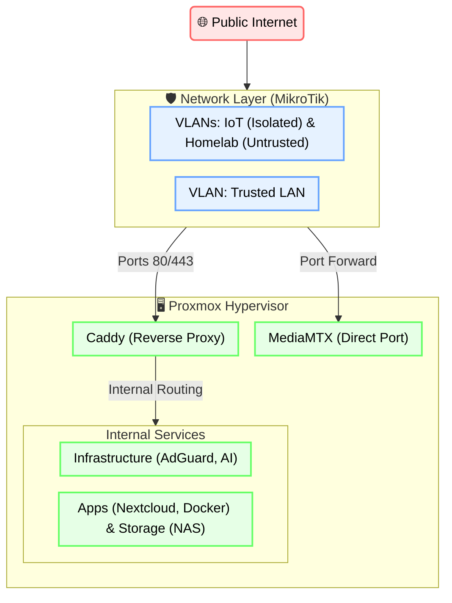

# 🖥️ KP's Homelab Blueprint: Infrastructure & Documentation

This repository is the central "Source of Truth" for my private cloud infrastructure. It transitions my homelab from a monolithic "manual" setup to a mature, distributed, GitOps-driven architecture.

## ⚙️ Tech Stack
*   **Hypervisor:** Proxmox VE
*   **Storage:** OpenMediaVault (SMB/NFS)
*   **Networking:** MikroTik RouterOS (VLANs)
*   **Ingress:** Caddy (Automated TLS)
*   **AI:** Gemini CLI, OpenClaw

---

## 🏗️ The Architecture
My lab is built on a **Defence-in-Depth** philosophy, utilising a dual-router physical isolation strategy and a Proxmox hypervisor layer.

---

## 💿 Storage & NAS Directory Layout
The following structure organizes data across the primary storage pool (typically mounted under `/mnt/pool` using a combination of LVM, ZFS, or MergerFS).

| 📁 Root Directory | 📝 Purpose / Description | 📂 Key Subdirectories |
| :--- | :--- | :--- |
| **`Apps`** | App-specific metadata (configs, databases, local cache). | `photoprism`, `anytype` |
| **`Private`** | Sensitive and private documents (served via SMB & VPN only). | `Documents`, `Photos`, `Video`, `Audio` |
| **`Media`** | Public/Shared media for Jellyfin & Symfonium. | `Music`, `Videos` |
| **`Downloads`** | Ingest zone for new content. | `Torrents`, `Youtube` |
| **`Shared`** | Collaboration and public-facing shares. | `Users` (`[USER-A/B/C]`, `Public`, `Recycled`) `Content` (`Public gallery`, `Temporary share`) |
| **`Shared_enc`** | Encrypted shares for sensitive remote access (e.g., Nextcloud). | `Users` (`[USER-A/B/C]`) `Private files` |

**Usage Principles:**
1. **Separation of Concerns:** Apps store their persistent configuration in `/Apps`, keeping `/Media` and `/Private` clean for data only.
2. **Access Control:** `/Private` should never be exposed to public-facing services without additional encryption layers.

---

## 📖 Project History & Intention
What began in 2014 as a humble Raspberry Pi download server has evolved over a decade into a comprehensive, self-hosted private cloud. Driven by a desire to bypass third-party cloud services, ensure data privacy, and learn modern architectures, this project documents continuous iteration. From early experiments with bare-metal setups and basic port forwarding, the infrastructure has matured through containerisation (Docker), network segmentation (MikroTik/VLANs), and enterprise-grade hypervisors (Proxmox). Today, it serves as a robust playground for deploying everything from self-hosted media servers and personal productivity apps, to experimenting with local LLMs and agentic AI automations.

---

## 🤖 Infrastructure as Intent
Instead of relying on rigid, syntax-heavy Infrastructure as Code (IaC) tools like Ansible, this homelab utilises **Infrastructure as Intent** and **Agentic Automation**.

By maintaining a highly structured set of Markdown notes, an AI Agent acts as the automation layer. The notes serve a dual purpose: human-readable documentation and machine-executable playbooks.
*   **Zero Syntax Overhead:** Avoids the rigid syntax of traditional IaC tools. Logic is plain English and standard shell commands.
*   **Context-Aware Execution:** The agent can diagnose, pivot, and handle unexpected errors on the fly during deployment, ensuring documentation acts as the exact executable "source of truth".

---

## 📂 Repository Index
The repository is organized following standard DevOps chapters. This structure also mirrors the centralized Obsidian Vault structure.

- **[00_Infrastructure](./docs/00_Infrastructure/)**: Bare-metal specs, Inventory, and Hypervisor/OS setup guides.
- **[01_Network](./docs/01_Network/)**: Routing logic, VLAN segmentation, and VPN configs.
- **[02_Services](./docs/02_Services/)**: Modular runbooks for self-hosted applications.
- **[03_Maintenance](./docs/03_Maintenance/)**: Tiered backup strategy and exclusion rules.
- **[04_Resources](./docs/04_Resources/)**: Linux CLI cheat sheets and external documentation links.
- **[05_AI_Tools](./docs/05_AI_Tools/)**: Agentic AI setup and IDE integrations.
- **[99_Archive](./docs/99_Archive/)**: Historical research and deprecated setups.