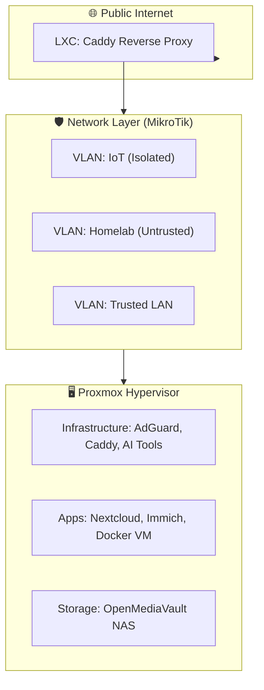

# 🚀 Homelab Blueprint: Infrastructure & Service Documentation

This repository is the central "Source of Truth" for my private cloud infrastructure. It transitions my homelab from a monolithic "manual" setup to a mature, distributed, and documented architecture.

---

## 🏗️ The Architecture
My lab is built on a **Defense-in-Depth** philosophy, utilizing a dual-router physical isolation strategy and a Proxmox hypervisor layer.

---

## 📂 Repository Index
The repository is organized following the dependency chain of a professional environment:

- **[00_Infrastructure](./docs/00_Infrastructure/)**: Bare-metal specs, Inventory, and Hypervisor/OS setup guides.
- **[01_Network](./docs/01_Network/)**: Routing logic, VLAN segmentation, and VPN configs.
- **[02_Services](./docs/02_Services/)**: Modular runbooks for self-hosted applications.
- **[03_Maintenance](./docs/03_Maintenance/)**: Tiered backup strategy and exclusion rules.
- **[04_Resources](./docs/04_Resources/)**: Linux CLI cheat sheets and external documentation links.
- **[05_AI_Tools](./docs/05_AI_Tools/)**: Agentic AI setup and IDE integrations.
- **[99_Archive](./docs/99_Archive/)**: Historical research and deprecated setups.

---

## 🛠️ Tech Stack
*   **Hypervisor:** Proxmox VE
*   **Storage:** OpenMediaVault (SMB/NFS)
*   **Networking:** MikroTik RouterOS (VLANs)
*   **Ingress:** Caddy (Automated TLS)
*   **AI:** Gemini CLI, OpenClaw

---

## 🎯 Design Philosophy
1.  **Security-First:** All services are assumed "untrusted" and isolated from the primary workstation LAN.
2.  **Stateless Compute:** VMs are treated as disposable; all persistent data is centrally managed on the NAS.
3.  **Documentation-Driven:** If it isn't documented, it doesn't exist. This repo allows for a 100% rebuild of the lab from scratch.

---

## 📜 Script Migration & Management Standards
When migrating or managing scripts across the homelab, the following industry-standard patterns are utilised:

1. **Docstrings & Changelogs:**
   - **Docstrings:** Keep a concise block at the top of scripts explaining their purpose, requirements (e.g., root access), and usage.
   - **Version Reconciliation:** Double-check that any file suffixes (e.g., `_v1`) match the version mentioned in the script's docstring. If there is a mismatch and it is not obvious how they should reconcile, ask for clarification before proceeding.
   - **Changelogs:** Do not maintain manual changelogs or version histories within the script files. Rely entirely on Git commit history.

2. **Sanitising Private Data (Secrets Management):**
   - **`.env` Files:** Hardcoding paths, usernames, IDs, and internal IPs is avoided. Instead, dynamic variables are loaded from `.env` files (e.g., `source .env`).
   - **`.gitignore`:** Ensure `*.env` is in the repository's `.gitignore` to prevent committing sensitive data. Provide a safe `.env.example` template in the repository for reference.
   - **SOPS:** While Mozilla SOPS or similar advanced secrets management tools might be considered in the future as the lab grows, the simpler `.env` file approach is the current standard.

3. **Deployment Strategy (Symlinks):**
   - **Centralised Repository:** The repository is cloned to a central location on each node (e.g., `/opt/homelab-repo`).
   - **Symlinking:** Scripts are mapped to their intended system paths (e.g., `/usr/local/bin/` or cron directories) using symlinks. This ensures that a simple `git pull` instantly updates the active scripts without disrupting the underlying system, allowing for a gradual, safe migration.
   - **Documentation:** All symlinks active on a given node must be documented in a central deployment file within that node's respective directory in the repository (e.g., `nodes/<node-name>/deployment.md`).

4. **Git Workflow (Commits & Pushes):**
   - **Commit Planning:** Before executing any git operations, present a clear plan of the sequential commits and proposed commit messages to the user.
   - **User Approval:** Always double-check and gain explicit approval for the commit plan before proceeding.
   - **Batch Pushing:** Sequential versions (e.g., `v1`, then `v2`) should be batched as separate local commits. Only execute a single `git push` at the very end of the migration sequence to synchronise with the remote repository.

---
*Created and maintained with the help of Gemini CLI Agent.*
