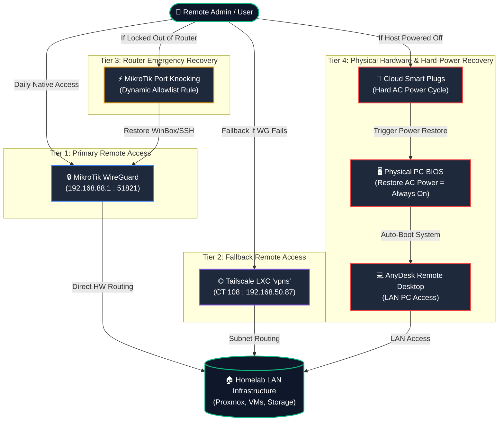

> [!NOTE]
> **Tags:** #MikroTik #VPN #WireGuard #Networking

# Virtual Private Networks (VPN)

**Current edge VPN:** MikroTik WireGuard on WAN (`listen-port` **51821**). Asus is **AP mode** — do not forward WG/OpenVPN to the Asus.

---

## 🛡️ Multi-Tier Remote Access & Failover Model

The homelab utilizes a 4-tier remote access hierarchy to ensure 100% remote management resilience:



### **Access Tiers Summary**
* **Tier 1 (Primary)**: MikroTik WireGuard (`listen-port 51821`) — Native high-speed WAN gateway.
* **Tier 2 (Fallback)**: Tailscale LXC (`vpns` / CT 108 / `192.168.50.87`) — Mesh VPN fallback with NAT traversal & subnet routing.
* **Tier 3 (Emergency Lockout)**: MikroTik Port Knocking — Secret packet sequence to unblock management access if firewall rules lock out standard ports.
* **Tier 4 (Hardware Recovery)**: App-managed Smart Plugs + BIOS AC Power Restore + AnyDesk on LAN PCs for hard power cycling and out-of-band desktop recovery.

---

## WireGuard Server Setup


### 1. Create WireGuard Interface

```bash
/interface wireguard add name=wireguard1 listen-port=51821 mtu=1420 comment="WireGuard server"
```

### 2. Assign IP Subnet to WireGuard

```bash
/ip address add address=[WG-SUBNET].1/24 interface=wireguard1 comment="WG subnet"
```

### 3. Add WireGuard to LAN Interface List

Treats WG clients as trusted for management (same as main LAN list membership):

```bash
/interface list member add interface=wireguard1 list=LAN
```

### 4. Client peer on phone/laptop and on MikroTik

```bash
/interface wireguard peers add interface=wireguard1 public-key="[CLIENT-PUBLIC-KEY]" \
    allowed-address=[WG-SUBNET].2/32 comment="[CLIENT-NAME]"
```

### 5. Firewall & NAT (current)

**Allow WireGuard handshake (WAN input):**

```bash
/ip firewall filter add action=accept chain=input protocol=udp dst-port=51821 \
    in-interface-list=WAN comment="Allow WireGuard handshake" log=yes log-prefix=wg_handshake
```


**MSS clamp** (avoids TCP black holes on the tunnel):

```bash
/ip firewall mangle
add action=change-mss chain=forward in-interface=wireguard1 new-mss=clamp-to-pmtu \
    protocol=tcp tcp-flags=syn comment="Clamp TCP MSS for WireGuard (in)"
add action=change-mss chain=forward out-interface=wireguard1 new-mss=clamp-to-pmtu \
    protocol=tcp tcp-flags=syn comment="Clamp TCP MSS for WireGuard (out)"
```

---

## Client Configuration (Example)

- **Addresses:** `[WG-SUBNET].2/32`
- **DNS:** Prefer **`[ADGUARD-IP]`** only (same as house DHCP). Using only `[WG-SUBNET].1` forces all client queries through the router.
- **Allowed IPs:** `0.0.0.0/0` (full tunnel) or split as needed
- **Endpoint:** `[DDNS_NAME].sn.mynetname.net:51821`
- **Public Key:** `[ROUTER-WG-PUBLIC-KEY]`

